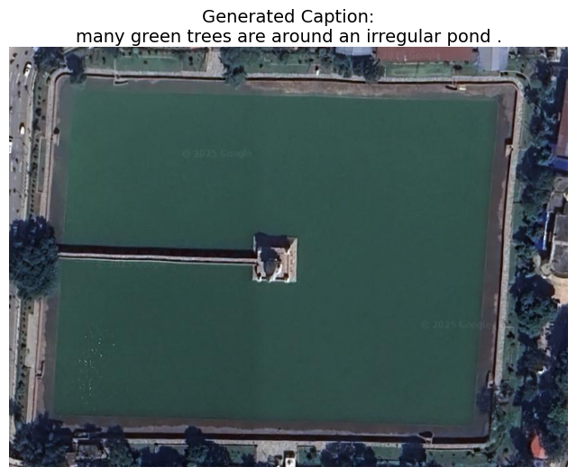
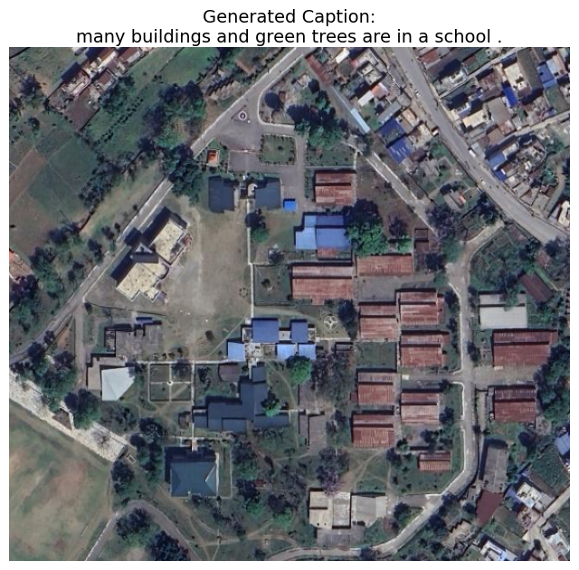

# RSICD Remote Sensing Image Captioning Project

This project focuses on generating natural language captions for remote sensing images using the **RSICD dataset**. It investigates the performance of different encoder-decoder architectures in understanding and describing aerial imagery.

## Objective

Develop and evaluate models capable of generating accurate, meaningful captions for satellite images. The project specifically compares:

- **CNN + LSTM**: Classic encoder-decoder approach using convolutional feature extraction and recurrent sequence modeling.
- **CNN + Transformer**: Combines convolutional visual encoders with attention-based Transformer decoders to capture richer contextual information.

## Dataset

**RSICD (Remote Sensing Image Caption Dataset)**

- ~10,000 high-resolution images
- Each image annotated with **5 human-written captions**
- Covers diverse land cover types: urban areas, forests, water bodies, farmland, and more

## Installation

1. Clone the repository:

   ```bash
   git clone https://github.com/Suyog-16/rsicd-image-captioning.git
   cd rsicd-captioning
   ```

2. Create a Python virtual environment (optional but recommended):

   ```bash
   python -m venv venv
   source venv/bin/activate  # On Windows: venv\Scripts\activate
   ```

3. Install dependencies:

   ```bash
   pip install -r requirements.txt
   ```

   <!-- 4. Download and place the RSICD dataset in the `data/` directory. Follow dataset instructions [here](https://github.com/xjtushilei/RSICD). -->

<!-- ## Usage

### Training

```bash
python train.py --model cnn_lstm --epochs 50 --batch_size 32
python train.py --model cnn_transformer --epochs 50 --batch_size 32
```

### Inference

```bash
python infer.py --image_path path/to/image.jpg --model_path path/to/model.pth
```

### Evaluation

```bash
python evaluate.py --model_path path/to/model.pth --metric BLEU,CIDEr,METEOR
``` -->

## Sample Outputs

<p align="center">
  
</p>

<p align="center">
  
</p>

## Evaluation Metrics

### - CNN + LSTM

**BLEU-1= 0.60**
**BLEU-2= 0.43**
**BLEU-3= 0.34**: as n-grams increase BLEU score decreases due to BLEU’s sensitivity to exact word matches.

**CIDEr = 0.64**: High, indicating captions are semantically correct and capture key content.

Interpretation: The model generates meaningful and descriptive captions, even if the wording differs from reference captions.

Takeaway: CIDEr is a better indicator of performance for RSICD than BLEU.
<br>

### CNN + Transformer

**BLEU-1= 0.63**
**BLEU-1= 0.46**
**BLEU-1= 0.36**

**CIDEr = 0.74**
Improved the CIDEr score significantly but BLEU score have slightest gains due to less exact n-gram matches , since the dataset contained similar(different) words to describe the same thing

## Scope

The project emphasizes:

- Comparing encoder-decoder architectures for remote sensing image captioning
- Evaluating caption quality using standard metrics
- Serving as a foundation for future improvements such as multimodal models or pretraining on larger datasets
